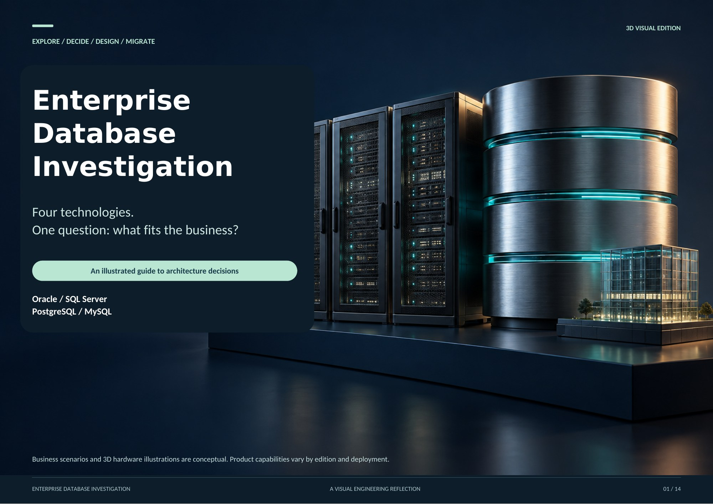

# Database Tasks and Projects

## Enterprise Database Investigation

**[Read the full report online](enterprise-database-investigation/README.md)** | **[Download PDF](https://raw.githubusercontent.com/M0hammedAlnajjar/Database-tasks-and-projects/main/enterprise-database-investigation/Enterprise-Database-Investigation-Solution.pdf)**

A 14-page visual investigation of Oracle, SQL Server, PostgreSQL, and MySQL, with detailed mind maps and realistic 3D illustrations.

The report covers business decisions, licensing and operating costs, cloud deployment, scalability, security, backup and recovery, and database migration.
