# Enterprise Database Investigation

**[Download the original PDF](https://raw.githubusercontent.com/M0hammedAlnajjar/Database-tasks-and-projects/main/enterprise-database-investigation/Enterprise-Database-Investigation-Solution.pdf) | [Back to the repository](../README.md)**

Read the complete 14-page report below. Select a page image to enlarge it.

عرض التقرير كاملًا بالصور، دون الحاجة إلى معاينة PDF. اضغط على أي صفحة لتكبيرها.

## 01 - Overview

## 02 - Oracle

[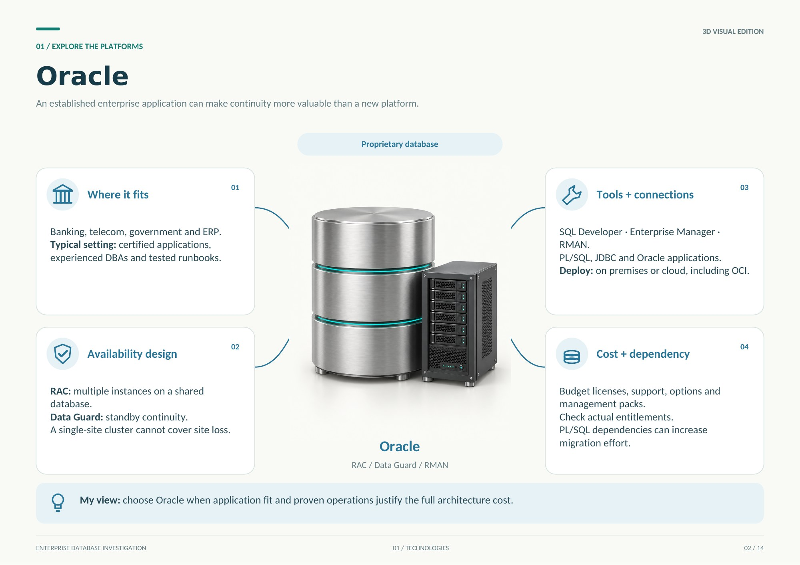](pages/page-02.jpg)

## 03 - SQL Server

[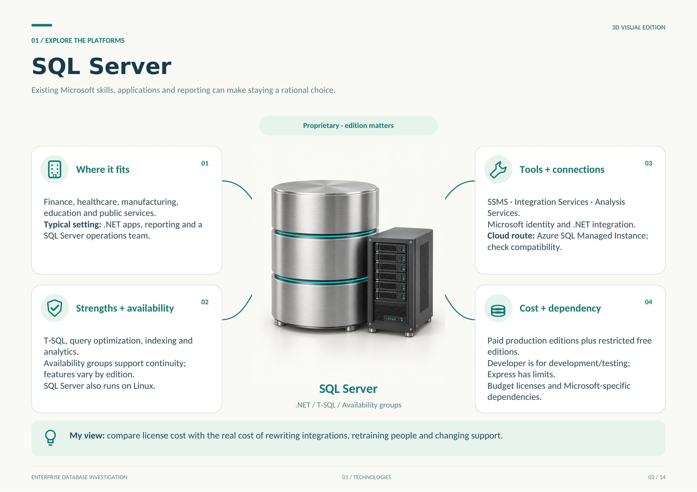](pages/page-03.jpg)

## 04 - PostgreSQL

[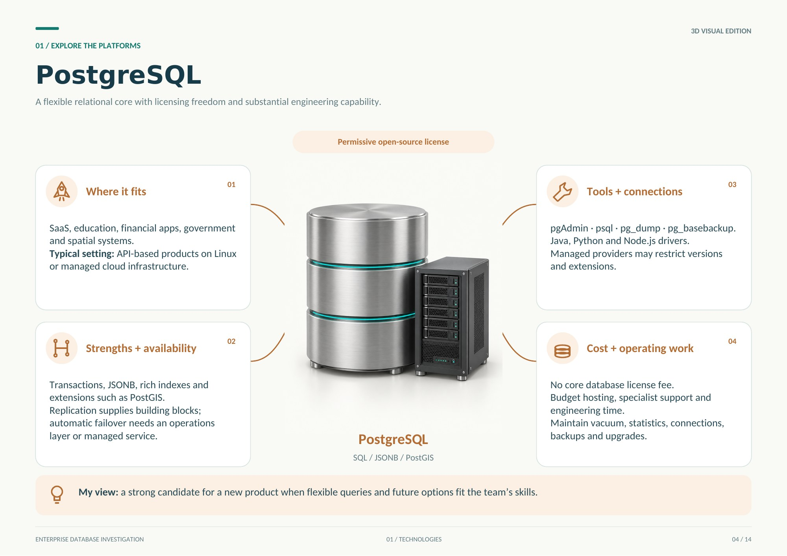](pages/page-04.jpg)

## 05 - MySQL

[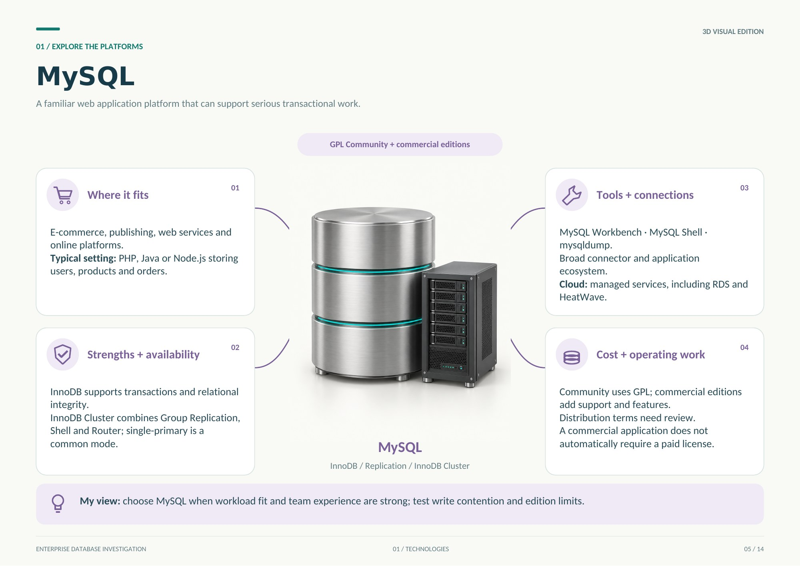](pages/page-05.jpg)

## 06 - Business decisions

[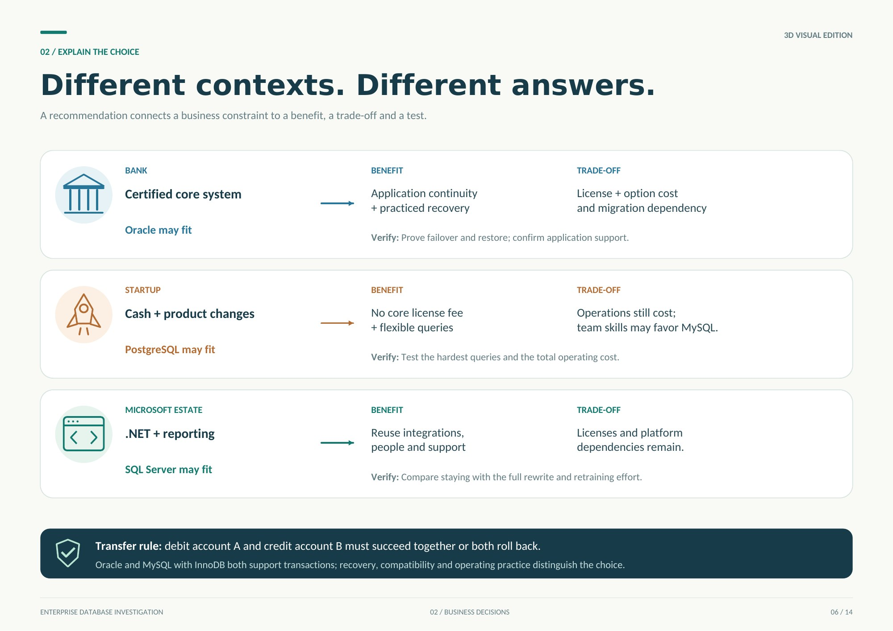](pages/page-06.jpg)

## 07 - Industry requirements

[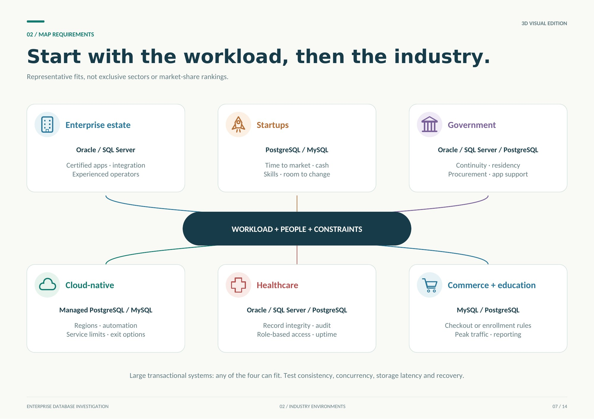](pages/page-07.jpg)

## 08 - Scalability and performance

[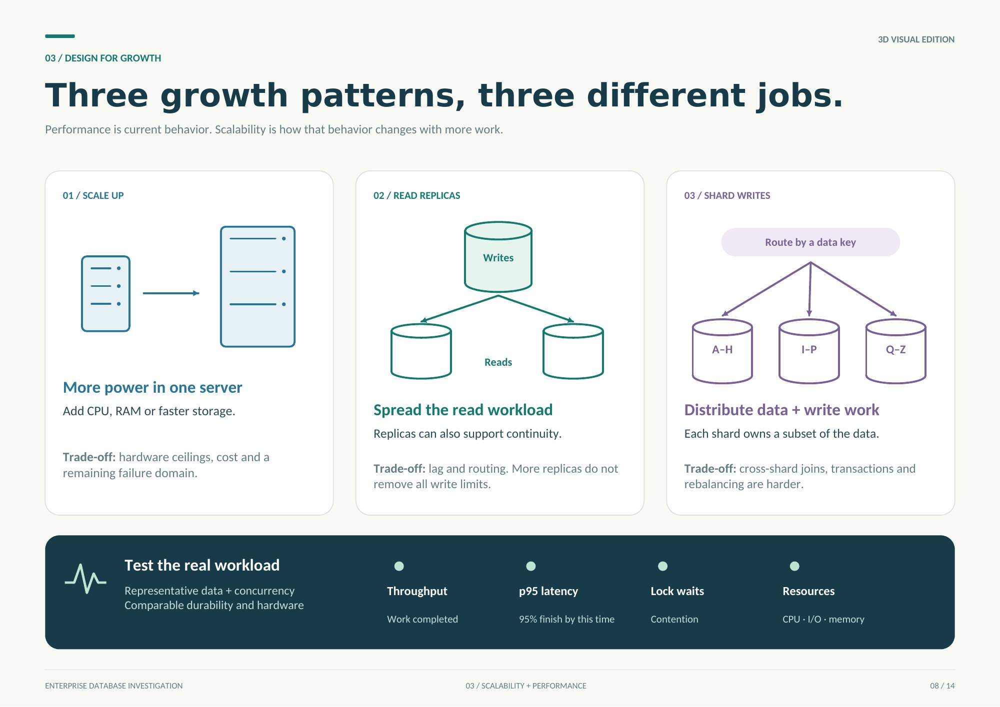](pages/page-08.jpg)

## 09 - Cloud and operating costs

[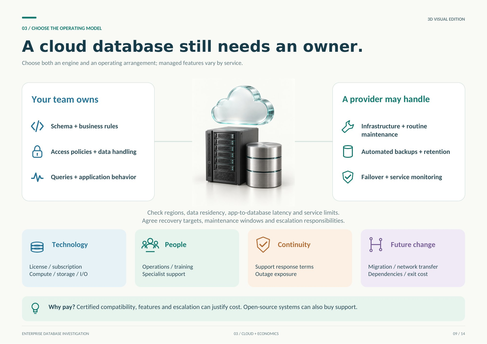](pages/page-09.jpg)

## 10 - Security and backups

[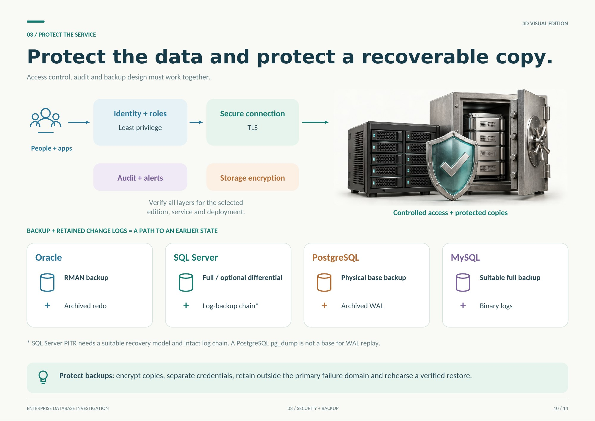](pages/page-10.jpg)

## 11 - Recovery objectives

[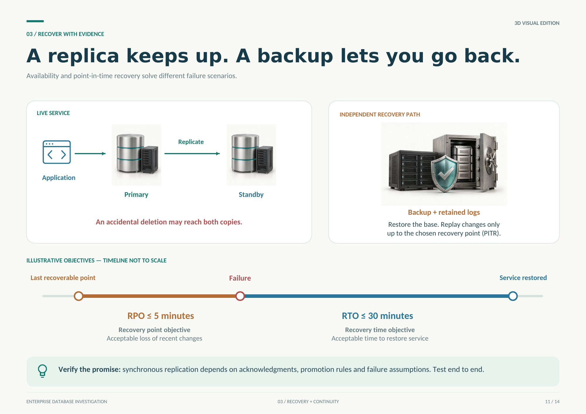](pages/page-11.jpg)

## 12 - Migration risks

[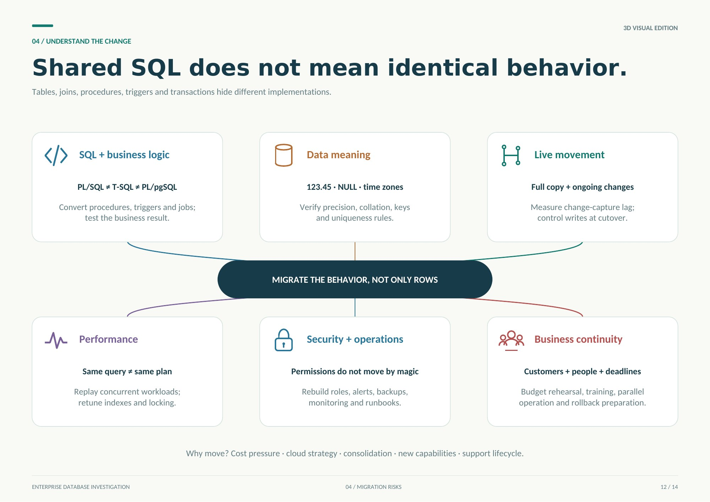](pages/page-12.jpg)

## 13 - Migration and cutover

[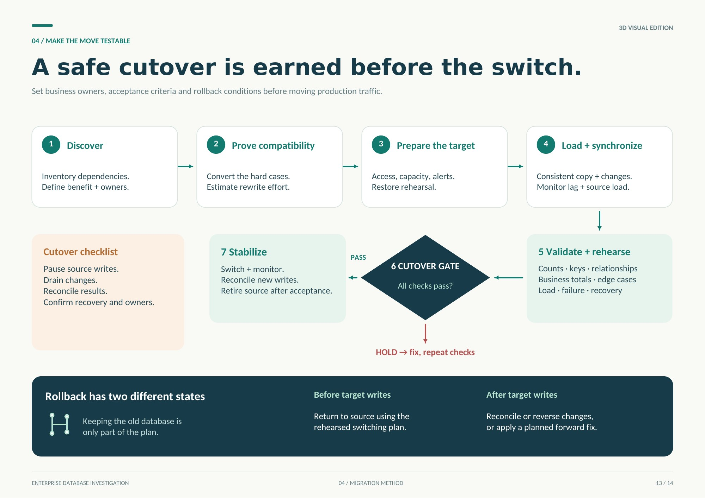](pages/page-13.jpg)

## 14 - Engineering reflection

[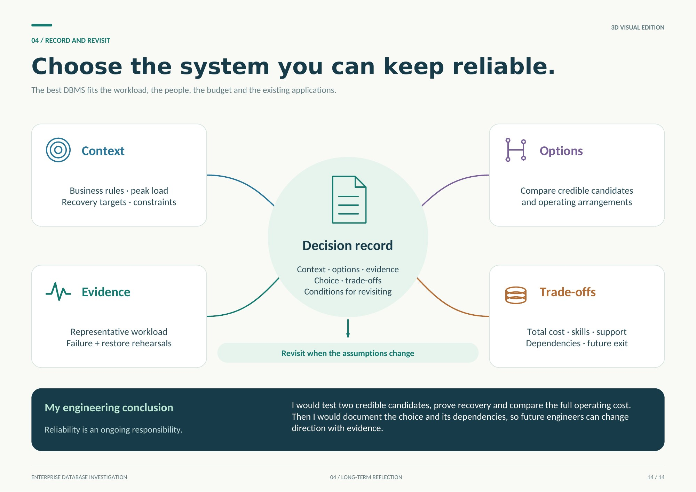](pages/page-14.jpg)
